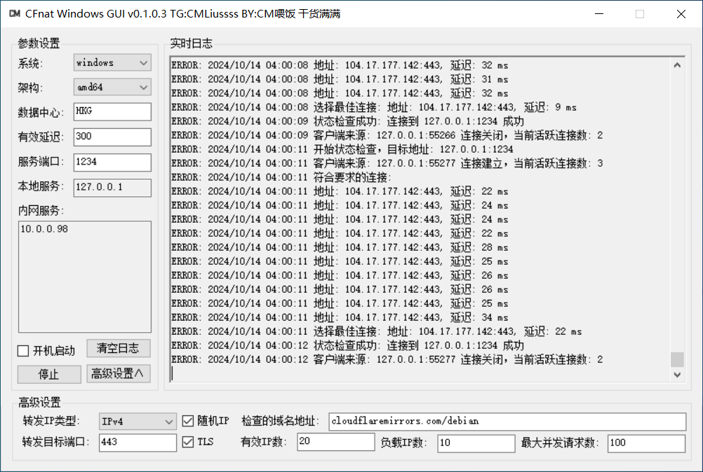

# CFnat-Windows-GUI
首先声明，这款软件并非我原创开发，而是目前了解到由 **股神** 在 [CF中转IP 频道](https://t.me/CF_NAT/38840) 发布的一款实时筛选 Cloudflare 数据中心的软件。我所编写的GUI是在这位开发者的原始版本基础上进行的**二次开发**。

CFNAT 是一款自动查找并优化 Cloudflare IP 转发的工具，旨在**解决泛播 IP 路由不稳定的问题**。如果你曾找到过速度不错的 Cloudflare IP，CFNAT 能帮助你快速筛选出最佳 IP 并实现端口转发，从而提升网络使用体验。因此，这款工具对于**移动、广电网络用户来说尤为明显**！

Telegram交流群：[@CMLiussss](https://t.me/CMLiussss)，YouTuBe：[CM喂饭 干货满满](https://www.youtube.com/@CMLiussss)

# 免责声明
CFnat 相关项目仅供教育、研究和安全测试目的而设计和开发。本项目旨在为安全研究人员、学术界人士及技术爱好者提供一个探索和实践网络通信技术的工具。
在下载和使用本项目代码时，使用者必须严格遵守其所适用的法律和规定。使用者有责任确保其行为符合所在地区的法律框架、规章制度及其他相关规定。

### 使用条款

- **教育与研究用途**：本软件仅可用于网络技术和编程领域的学习、研究和安全测试。
- **禁止非法使用**：严禁将 **CFnat-Windows-GUI** 用于任何非法活动或违反使用者所在地区法律法规的行为。
- **使用时限**：基于学习和研究目的，建议用户在完成研究或学习后，或在安装后的**24小时内，删除本软件及所有相关文件。**
- **免责声明**：**CFnat-Windows-GUI** 的创建者和贡献者不对因使用或滥用本软件而导致的任何损害或法律问题负责。
- **用户责任**：**用户对使用本软件的方式以及由此产生的任何后果完全负责。**
- **无技术支持**：本软件的创建者不提供任何技术支持或使用协助。
- **知情同意**：使用 **CFnat-Windows-GUI** 即表示您已阅读并理解本免责声明，并同意受其条款的约束。

**请记住**：本软件的主要目的是促进学习、研究和安全测试。作者不支持或认可任何其他用途。使用者应当在合法和负责任的前提下使用本工具。

---



## 参数说明
- 也可直接使用`cmd`带参执行原程序，例如：`cfnat-windows-amd64.exe -addr="0.0.0.0:1234" -colo=HKG -delay=100 -port=80 -tls=false`
```
  -addr string
        服务端口: 本地监听的 IP 和端口 (default "0.0.0.0:1234")
  -code int
        HTTP/HTTPS 响应状态码 (default 200)
  -colo string
        数据中心: 筛选数据中心例如 HKG,SJC,LAX (多个数据中心用逗号隔开,留空则忽略匹配)
  -delay int
        有效延迟（毫秒）: 超过此延迟将断开连接 (default 300)
  -domain string
        响应状态码检查的域名地址 (default "cloudflaremirrors.com/debian")
  -ipnum int
        有效IP数: 提取的有效IP数量 (default 20)
  -ips string
        转发IP类型: 指定生成IPv4还是IPv6地址 (4或6) (default "4")
  -num int
        负载IP数: 目标负载 IP 数量 (default 10)
  -port int
        转发目标端口 (default 443)
  -random
        是否随机生成IP，如果为false，则从CIDR中拆分出所有IP (default true)
  -tls
        是否为 TLS 端口 (default true)
  -task int
        最大并发请求数: 并发请求最大协程数 (default 100)
```

## 经验之谈
1. **CFnat**和**梯子**在**同一台设备上运行**时使用**本地服务IP:端口**连接。
2. **CFnat**和**梯子**分别处在**同一局域网内的两台设备上运行**时使用**内网服务IP:端口**连接。
3. 如果你是使用 [cmliu/edgetunnel](https://github.com/cmliu/edgetunnel) 的节点，可将**本地服务IP:端口**和**内网服务IP:端口**都添加至`ADD`变量里，直接订阅食用即可
4. **移动/广电**用户设置数据中心`HKG`直接起飞！**电信/联通**用户设置`SJC,LAX`！
5. 在跑过一次优选之后，可在`colo`文件夹里可以看到`ip.csv`扫描结果, 里面就能看到你的当前网络网络环境下能跑出来的所有数据中心！

## GUI文件结构
```shell
CFnat Windows GUI.exe      # GUI本体
cfnat.ini                  # GUI配置文件
cfnat-windows-386.exe      # cfnat x86_32位 原程序本体
cfnat-windows-amd64.exe    # cfnat x86_64位 原程序本体
cfnat-windows-arm.exe      # cfnat arm_32位 原程序本体
cfnat-windows-arm64.exe    # cfnat arm_64位 原程序本体
cfnat-windows7-386.exe     # cfnat Win7_x86_32位 原程序本体 Win7专用
cfnat-windows7-amd64.exe   # cfnat Win7_x86_64位 原程序本体 Win7专用
colo
 ├─ colo-windows-386.exe   # colo x86_32位 用于生成缓存IP库
 ├─ colo-windows-amd64.exe # colo x86_64位 用于生成缓存IP库
 ├─ colo-windows-arm.exe   # colo arm_32位 用于生成缓存IP库
 ├─ colo-windows-arm64.exe # colo arm_64位 用于生成缓存IP库
 ├─ ip.csv                 # colo 扫描结果 用于生成缓存IP库
 ├─ ips-v4.txt             # IPv4库
 ├─ ips-v6.txt             # IPv6库
 └─ locations.json         # CF数据中心json文件
ips-v4.txt                 # 缓存IPv4库
ips-v6.txt                 # 缓存IPv6库
locations.json             # CF数据中心json文件
Newtonsoft.Json.dll        # 验证版本信息组件
Newtonsoft.Json.xml        # 验证版本信息组件
```

## Star 星星走起
[](https://starchart.cc/cmliu/CFnat-Windows-GUI)

# 致谢
我自己的脑洞，ChatGPT，[股神](https://t.me/CF_NAT/38840)
